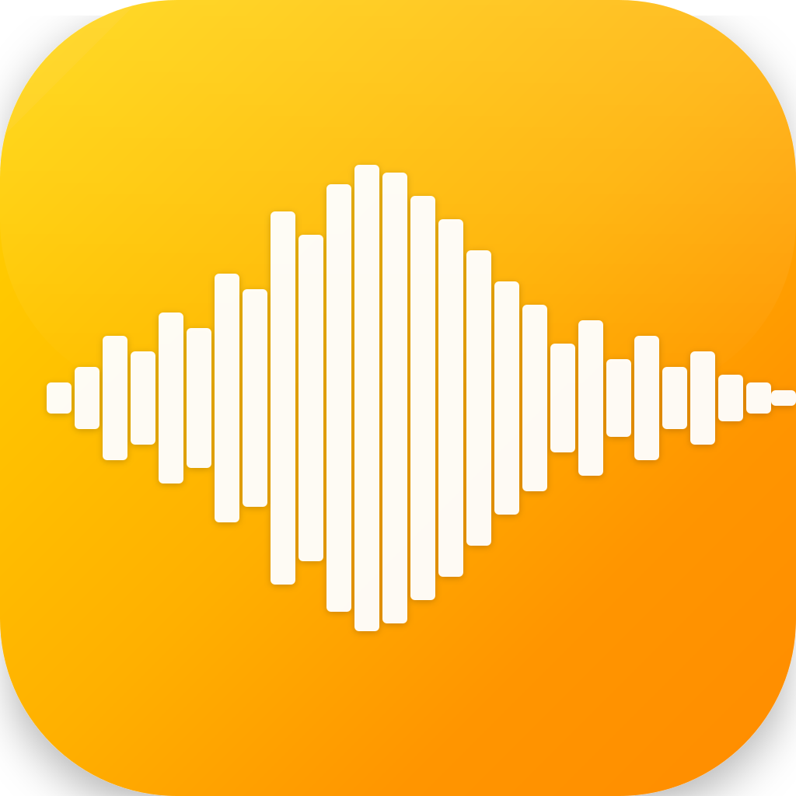

# No-BS White Noise

Fast, simple, focused. White noise that just works.

## What It Does

Generates high-quality background noise for focus, sleep, or relaxation. Five sounds, one purpose: **helping you concentrate**.

- **White Noise** — Classic broadband static
- **Brown Noise** — Warmer, deeper rumble  
- **Fire** — Authentic crackling fireplace
- **Rain** — Natural rainfall with distant thunder
- **Birds** — Peaceful forest ambience

## Why It Exists

This app harkens back to a time when software could be built for a single purpose and be fast, simple, and lightweight. Inspired by [Craig Mod's philosophy on fast software](https://craigmod.com/essays/fast_software/), it prioritizes speed and simplicity over feature bloat.

**No tracking. No analytics. No subscriptions. No BS.**

## Design

Built for iOS 26 with Apple's revolutionary **Liquid Glass** design system:

- **Translucent Materials** — Layers of ultra-thin glass that refract surrounding content
- **Dynamic Reflections** — Specular highlights and real-time light responses
- **Fluid Animations** — Smooth spring-based transitions with perfect damping
- **Atmospheric Depth** — Multi-layer shadows and gradients for dimensional UI
- **Adaptive Themes** — Seamlessly morphs between light, dark, and system modes

Every interface element—from the play button to the sound selector—features authentic glass-like depth with refraction, reflection, and translucency effects that bring a tactile, premium feel to the experience.

## Technical Details

- **Pure Swift** — Built with modern iOS development best practices
- **iOS 26 Liquid Glass** — Advanced material effects with `.ultraThinMaterial` and `.thinMaterial`
- **Multi-layer visual effects** — Radial and linear gradients for realistic glass refraction
- **Optimized for overnight use** — Battery-efficient audio processing
- **Works in silent mode** — Uses media playback audio session
- **Instant sound switching** — No glitchy transitions between generated sounds
- **High-quality procedural audio** — Most sounds generated algorithmically for tiny app size
- **Accessibility-first** — WCAG-compliant contrast maintained throughout all visual effects

## Design Philosophy

Software should **lessen burdens, not increase them**. This app:

- Launches instantly
- Switches sounds without lag
- Runs all night without draining battery
- Works exactly as expected, every time
- Gets out of your way so you can focus on what matters

Built for people who value their time and attention.
