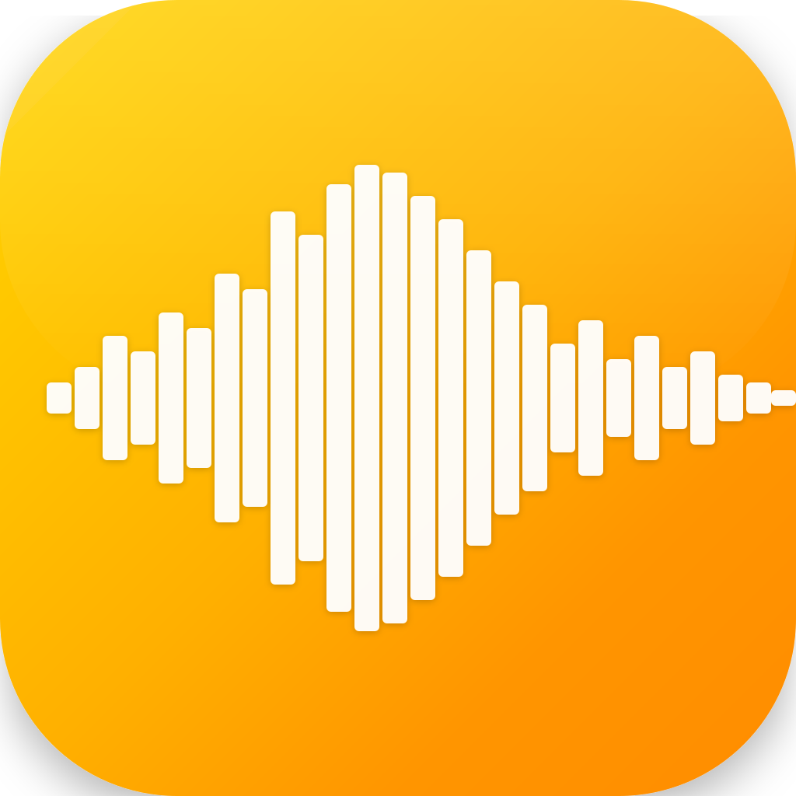
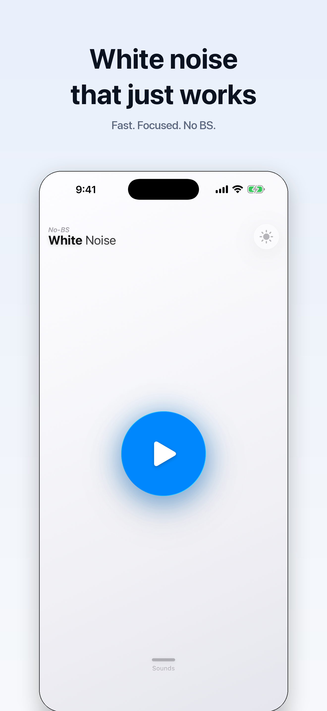
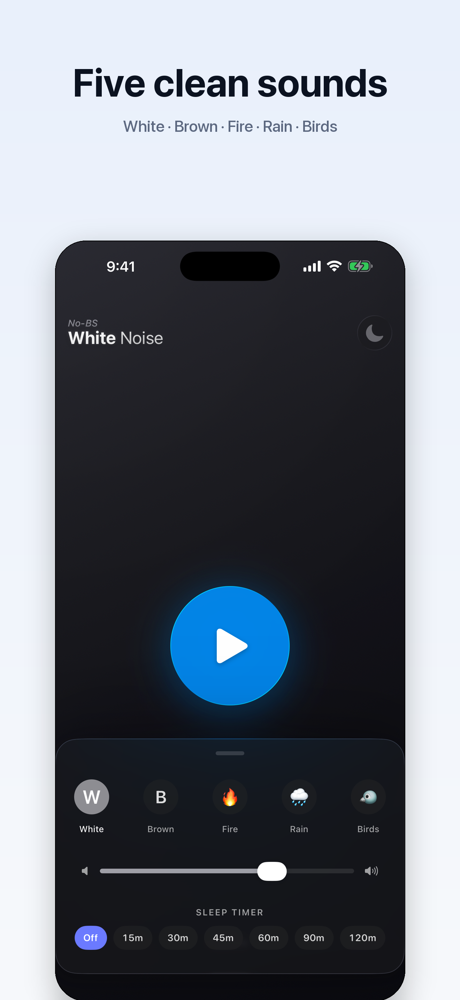
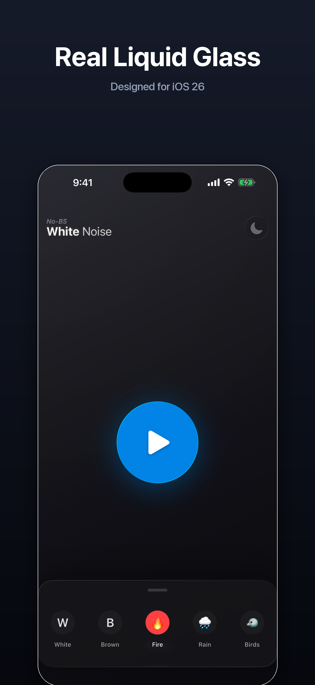
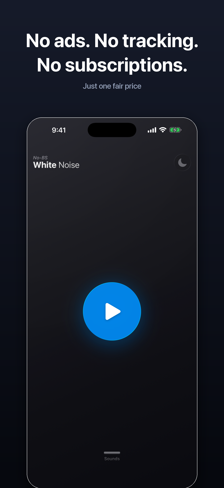

# No-BS White Noise

**White noise that just works.** Fast, simple, focused.

## Screenshots

&nbsp;&nbsp;

&nbsp;&nbsp;

&nbsp;&nbsp;

## What It Does

Generates high-quality background noise for focus, sleep, or relaxation. Five sounds, one purpose: **helping you concentrate**.

- **White Noise** — Classic broadband static
- **Brown Noise** — Warmer, deeper rumble  
- **Fire** — Crackling fireplace
- **Rain** — Steady, even rainfall
- **Birds** — Peaceful forest ambience

## Why It Exists

This app harkens back to a time when software could be built for a single purpose and be fast, simple, and lightweight. Inspired by [Craig Mod's philosophy on fast software](https://craigmod.com/essays/fast_software/), it prioritizes speed and simplicity over feature bloat.

**No tracking. No analytics. No subscriptions. No BS.**

## Design

Built for iOS 26 with Apple's **Liquid Glass** design system — the genuine system material, not a lookalike:

- **Real `glassEffect`** — The play button, sound selector, and menu use Apple's live Liquid Glass with interactive touch response and tinting
- **`GlassEffectContainer`** — Nearby glass shapes blend and morph together
- **Fluid Animations** — Smooth spring-based transitions with perfect damping
- **Adaptive Themes** — Clean light and dark modes that match your system on first launch
- **Graceful fallback** — On iOS 18.2–25, controls fall back to a translucent-material rendering via `#available` checks

Every interface element—from the play button to the sound selector—uses authentic Liquid Glass depth, refraction, and translucency for a tactile, premium feel.

## Technical Details

- **Pure Swift** — Built with modern iOS development best practices
- **iOS 26 Liquid Glass** — Genuine `.glassEffect` and `GlassEffectContainer`, gated with `#available` for a clean fallback on earlier iOS
- **Voice & system integration** — Siri App Intents, Control Center, and Lock Screen playback controls
- **Optimized for overnight use** — Battery-efficient audio processing
- **Works in silent mode** — Uses media playback audio session
- **Instant sound switching** — No glitchy transitions between generated sounds
- **High-quality procedural audio** — Most sounds generated algorithmically for tiny app size
- **Accessibility-first** — WCAG-compliant contrast maintained throughout all visual effects

## Design Philosophy

Software should **lessen burdens, not increase them**. This app:

- Launches instantly
- Switches sounds without lag
- Runs all night without draining battery
- Works exactly as expected, every time
- Gets out of your way so you can focus on what matters

Built for people who value their time and attention.

## Privacy

**No-BS White Noise does not collect, store, or transmit any user data.**

### What We Don't Do:
- ❌ No tracking or analytics
- ❌ No user accounts or authentication
- ❌ No data collection of any kind
- ❌ No third-party SDKs or frameworks
- ❌ No advertising networks
- ❌ No crash reporting services
- ❌ No network requests (except standard iOS system calls)

### What the App Does:
- ✅ Generates audio locally on your device
- ✅ Plays audio files bundled with the app
- ✅ Stores your sound and theme preferences locally on your device only
- ✅ Integrates with iOS Control Center (standard iOS API)
- ✅ Uses background audio playback (standard iOS capability)

### Permissions:
The app does not request any permissions beyond standard audio playback.

**Your privacy is 100% protected because we simply don't collect anything.**

For questions, contact: chndlrcllns@gmail.com

## Roadmap

We're committed to keeping this app lightweight and focused while adding thoughtful improvements over time. Here's what's coming:

### Recently Shipped (v2.1)

- ✅ **Sleep Timer** — auto-stop with a gentle fade-out (15 min to 2 hours), live countdown
- ✅ **Volume Control** — master volume slider, right in the sounds drawer
- ✅ **Fade In/Out** — click-free, gentle starts and stops
- ✅ **Siri & Shortcuts** — start any sound or set a sleep timer by voice
- ✅ **Control Center & Lock Screen** — full playback controls
- ✅ **Real iOS 26 Liquid Glass** — the genuine system material throughout

### Coming Soon

**Home Screen Widget**
Launch your preferred sound instantly from the home screen without opening the app.

**Sound Mixing**
Layer sounds together (Rain + Fire, anyone?) — the new audio engine was built with this in mind.

### Future Considerations

**Favorites & Quick Access**
Mark your most-used sounds as favorites for even faster switching.

**Focus Mode Integration**
Seamless integration with iOS Focus modes to automatically start your preferred sound.

**Apple Watch Companion**
Control playback directly from your wrist without pulling out your phone.

**Mac Support**
Bring the same fast, focused experience to the desktop.

---

**Philosophy**: Every feature must earn its place by enhancing focus without adding complexity. If it doesn't serve the core mission—helping you concentrate—it doesn't belong.

Have a suggestion? [Open an issue](https://github.com/chandlercollins/no-bs-white-noise/issues) and let's discuss.
